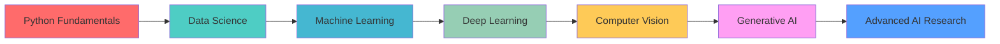

# 💫 Abhay Ayare 
### AI/ML Developer | Data Science Enthusiast | Electronics Engineering Student


<div align="center">

[](https://www.linkedin.com/in/abhay-ayare)  [](https://www.kaggle.com/abhayayare)  [](https://leetcode.com/u/Abhay6116)  [](https://www.hackerrank.com/profile/ayareabhay129)  


</div>

## 👋 About Me

```python
class AboutMe:
    def __init__(self):
        self.name = "Abhay Sanjay Ayare"
        self.education = "B.Tech in Electronics & Telecommunication Engineering"
        self.college = "KIT's College of Engineering, Kolhapur (2021-2025)"
        self.cgpa = "7.3"
        self.interests = ["AI/ML", "Computer Vision", "Data Science", "Deep Learning"]
        self.current_focus = "Building intelligent systems that solve real-world problems"
    
    def get_skills(self):
        return {
            "programming": ["Python", "C++", "SQL", "JavaScript"],
            "ml_frameworks": ["TensorFlow", "OpenCV", "YOLO", "Scikit-learn"],
            "data_tools": ["Pandas", "NumPy", "Matplotlib", "PowerBI"],
            "tools": ["Git", "VS Code", "Streamlit", "Docker"]
        }

me = AboutMe()
````


## 📊 GitHub Stats & Analytics

<div align="center">


</div>

---

## 🛠️ Tech Stack & Superpowers

### 🤖 Artificial Intelligence & Machine Learning

<div align="center">


</div>

### 📊 Data Science & Analytics

<div align="center">


</div>

### 💻 Programming Languages

<div align="center">


</div>

### 🛠️ Development Tools

<div align="center">


</div>

---


**Highlights:**

* 📊 Interactive PowerBI dashboards
* 🔮 Predictive risk assessment models
* 📋 Comprehensive data analysis and visualization
* 💡 Actionable insights for preventive healthcare

---

## 📚 Certifications & Achievements

<div align="center">

| Certification                  | Issuer              | Status         |
| ------------------------------ | ------------------- | -------------- |
| Data Analytics & Visualization | Accenture (Forage)  | ✅ Completed    |
| Generative AI Fundamentals     | Google Cloud        | ✅ Completed    |
| Python Workshop                | IIT Bombay Techfest | ✅ Completed    |
| Complete Data Science Bootcamp | Udemy               | ✅ Completed    |
| 40 Real-World ML Projects      | Udemy               | 🎯 In Progress |

</div>

---

## 🏆 Leadership & Activities

🎯 **President - Matrix Student Club (ISRO-IIRS Astronomical Club)**
KIT's College of Engineering, Kolhapur

```python
achievements = {
    "events_managed": ["Avbodh", "Chandrayaan Mahotsav", "Celestial Canvas"],
    "participants_reached": "500+ students",
    "technical_sessions": "15+ workshops",
    "space_awareness": "Promoted astronomy education"
}
```
}

## 📈 Current Learning Journey


---

## 🌟 What I Bring to the Table

```python
class MySkills:
    def technical_skills(self):
        return {
            "ai_ml": ["Computer Vision", "Deep Learning", "Predictive Modeling"],
            "data_science": ["Data Analysis", "Visualization", "Statistical Modeling"],
            "programming": ["Python", "C++", "JavaScript", "SQL"],
            "tools": ["TensorFlow", "OpenCV", "PowerBI", "Git"]
        }
    
    def soft_skills(self):
        return ["Problem Solving", "Leadership", "Adaptability", "Continuous Learning"]
    
    def projects(self):
        return ["End-to-end ML pipelines", "Real-time AI systems", "Data Analytics"]
```

---

## 📞 Let's Collaborate!

<div align="center">

💼 *Open for Opportunities:*
🤖 AI/ML Research Internships • 📊 Data Science Projects • 💻 Software Development Roles • 🔬 Research Collaborations

📬 *Get in Touch:*
[](mailto:abhayayare29@gmail.com)
[](https://abhay-portfolio-574e7.web.app/)  


</div>

---

## 💡 Fun Facts & Philosophy

```python
while True:
    learn_new_technology()
    build_innovative_projects()
    contribute_to_community()
    if world_improved():
        break
```

🎯 **My Coding Philosophy:**
*"Write code that not only works but tells a story. Build solutions that don't just solve problems but inspire new possibilities."*

⚡ **Daily Mantra:**
*"Every line of code is a step toward a smarter future. Every algorithm learned is a tool to shape tomorrow."*

---

<div align="center">

🚀 **Thanks for visiting my profile!**
*Let's connect and build the future of AI together!*


⭐ *Feel free to star my repositories if you find them interesting!*

</div>

---

📌 *Last Updated: september 2025  | 🎨 Designed with ❤️ by Abhay Ayare*


